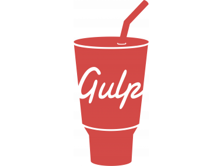
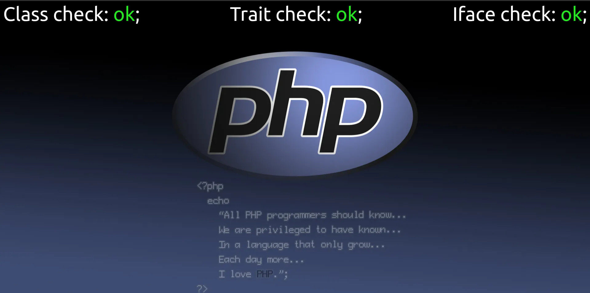

<div style="text-align:center;">
  
</div>
# GulpPack by EvanLongin version 2.1!
##### Обновление до версии 2.1: Добавлены большие изменения для php-сборки, подробнее в описании.
[English description](#table-of-contents)


## Оглавление
1. [Структура папок](#структура-папок)
2. [Инициализация и начало работы](#инициализация-и-начало-работы)
3. [Команды запуска сборки и npm-скриптов](#команды-запуска-сборки-и-npm-скриптов)
4. [Работа с HTML](#работа-с-html)
5. [Работа с (S)CSS](#работа-с-scss)
6. [Работа с JavaScript](#работа-с-javascript)
7. [Работа с изображениями (кроме SVG)](#работа-с-изображениями-кроме-svg)
8. [Работа с SVG](#работа-с-svg)
9. [Работа со шрифтами](#работа-со-шрифтами)
10. [Splide js](#splide-js)
11. [Bootstrap](#bootstrap)
12. [Линтеры](#линтеры)
13. [Сборка для PHP (beta)](#сборка-для-php)

## Структура папок
Проект имеет структуру вида:

### dev/ - папка разработки &#8594;
#### ./css - папка с основным файлом стилей.
#### ./fonts - папка со шрифтами.
#### ./html - папка с html-файлами.
#### ./images - папка с изображениями.
#### ./js - папка с javascript-файлами.
#### ./scss - папка с scss-файлами.
#### ./index.html - основной html-файл.
***
### dist/ - папка для скомпилированного проекта.
***
#### ./gulpfile.js - файл с настройками и функциями gulp.
#### ./package.json - файл со списком установленных пакетов.
#### ./README.md - этот файл Вы читаете в данный момент
#### ./webpack.config.js - файл настройки webpack.
***
## Инициализация и начало работы
Для начала работы со сборкой следует скопировать содержимое репозитория на компьютер с помощью команды:

```git clone https://github.com/Longin89/gulpPack.git```

и после этого в папке сборки выполнить команду:
```npm i```

## Команды запуска сборки и npm-скриптов
```gulp``` - запуск сборки в режиме разработки. В этом режиме запускается BrowserSync (для отслеживания изменений онлайн), а так-же функции из файла **gulpfile.js** для работы с проектом. Все файлы (кроме изображений и [main.bundle.js](#работа-с-javascript)) в папке **dev/** не минифицируются и не конкатенируются.

```gulp build``` - запуск сборки в режиме production. В этом режиме проект компилируется в папку **dist/** для передачи заказчику, либо загрузки на хостинг. Файлы стилей, html-документы и изображения минифицируются, файлы js проходят через webpack и Babel, минифицируются и конкатенируются.

```gulp backend``` (**тестовая функция**) - запуск сборки в режиме backend. В этом режиме сборка из папки **dev/** в папку **dist/** с конкатенированными файлами стилей, html и js. Минификация к файлам не применяется, изображения оптимизируются.

```gulp fonts``` - конвертация шрифтов из ttf в woff2. Исходники шрифтов следует положить в папку **dev/fonts/src**. После выполнения команды искомые шрифты появятся в папке **dev/fonts**

```gulp zip``` - архивация папки **dist/**. Одноименный архив сохраняется в корне проекта.

```npm run html``` - скрипт проверки html-файлов на W3C-валидаторе. Проверяются все файлы, находящиеся в корне папки **dev/**.

## Работа с HTML
В основную страницу с помощью плагина *[gulp-file-include](https://www.npmjs.com/package/gulp-file-include)*  уже вставлены части(**partials**) других файлов (```footer.html```, ```head.html```, ```footer.html```). Встраивание в документ происходит с помощью директивы ```@@include``` (например ```@@include('partials/head.html')```). Вы так-же можете создавать свои страницы и оперировать с ними тем-же образом.

**Важно!** Для корректной работы сборки все html-файлы должны находится в директории **dev/html**.

**Важно №2** В файле ```head.html``` помимо стандартных настроек прописан тэг вида ```<link rel="preload"...``` - он нужен для предзагрузки используемых Вами шрифтов, необходимо прописать туда полное имя файла(ов), находящихся в папке **dev/fonts**. Предзагрузка опциональна, при желании отключается простым удалением тэга.

## Работа с (S)CSS
Для работы используется препроцессор sass в синтаксисе scss. Во время процесса разработки, работа со стилями происходит в директории **dev/scss**. файлы в которой, в свою очередь разделены на секции:

**style.scss** - основной файл стилей, в который по умолчанию импортируются все остальные.

**./components/_defaults.scss** - файл со стилями по умолчанию для базового проекта (как то - ширина ограничительного контейнера, размер и семейство базового шрифта, прижатие футера к низу страницы и т.д.)

**./components/_fonts.scss** - файл, в который через директиву ```@incliude``` импортируются пользовательские шрифты.

**./components/_footer.scss** - файл для "подвала" проекта.

**./components/_header.scss** - файл для "шапки" проекта.

**./components/_media.scss** - файл для медиа-запросов.

**./components/_mixins.scss** - файл для хранения "примесей". По умолчанию уже хранит в себе миксина для быстрого добавления / использования шрифтов, а так-же градиентов.

**./components/_normalize.scss** - файл нормализации, версия 8.0.1.

**./components/_vars.scss** - файл для хранения переменных.

При разработке проекта, компилируемый на выходе **style.min.css** хранит в себе стили из всех вышеперечисленных файлов в неминифицированном виде. Отдельным файлом создается **style.min.css.map**, содержащий в себе карты стилей, полученные с помощью плагина *[gulp-sourcemaps](https://www.npmjs.com/package/gulp-sourcemaps)*.

## Работа с JavaScript
Для работы с js в сборке используется webpack и babel. Файлы так-же разделены на секции:

**main.js** - основной файл для разработки, не прошедший через webpack и babel.

**main.bundle.js** - основной файл после webpack, babel и конкатенации.

**./components/_functions.js** - файл для хранения функций.

**./components/_vars.js** - файл для хранения переменных.

Режим сборки запускается при разработке проекта (команда ```gulp```), в нем файлы не проходят транспилляцию и минификацию, 1 строка каждого входного файла на выходе начинается с комментария, в котором указывается информация об исходнике.

В режиме продакшена (команда ```gulp build```) конечный файл проходит транспилляцию через babel и минификацию.

В последней версии сборки для построения карт js-файлов используется webpack (файл **main.bundle.js.map** генерируется в корне папки **js/**).

## Работа с изображениями (кроме SVG)
Все изображения (кроме ```*.svg``` и ```*.ico```) следует помещать в папку **dev/images/src** - на выходе в папке **dev/images** Вы будете получать оптимизированные файлы в форматах ```*.jpeg``` и ```*.webp```.
Для добавления изображения на страницу используйте тэг `````` - при компиляции документа он, с помощью *[gulp-webp-html](https://www.npmjs.com/package/gulp-webp-html)* будет преобразован в тэг ```<picture>```, в котором, в зависимости от поддержки браузера будет использован ```jpeg``` или ```webp```-файл.

## Работа с SVG
Для конвертации SVG-файлов используется папка **dev/images/src/svg** - в нее помещаются исходники, которые после запуска разработки конвертируются и помещаются в папку **dev/images/svg_out**.

## Работа со шрифтами
С помощью плагина *[gulp-ttf2woff2](https://www.npmjs.com/package/gulp-ttf2woff2)* в сборке реализована возможность конвертации шрифтов из ttf в woff2 (описана [выше](#команды-запуска-сборки-и-npm-скриптов)). Рекомендуется подготавливать шрифты заранее.

## Splide JS
Для реализации слайдера первоначальный Swiper был заменен на *[Splide JS](https://splidejs.com/)*, т.к. на мой взгляд последний работает гораздо стабильнее. По умолчанию js и css-файлы слайдера выключены в сборке, для их включения раскомментируйте соответствующие строки в файлах **gulpfile.js** и **webpack.config.js**.

## Bootstrap
CSS-фреймворк *[bootstrap](https://getbootstrap.com/)*. Пакет опционален: для начала использования просто раскомментируйте строки, связанные с **bootstrap** в **gulpfile.js** и первую строку в  **dev/js/components/main.js**.

**ВАЖНО!** По умолчанию в **gulpfile.js** прописан файл **bootstrap.scss**, содержащий всю библиотеку и имеющий соответствующий размер, если Вы хотите облегчить сборку и использовать только определенные компоненты - измените путь к файлу(ам) на нужные (находятся в **/node_modules/bootstrap/scss**).

**ВАЖНО №2** При использовании bootstrap измените файл **dev/scss/components/_default.scss**, убрав у класса **container** свойства **margin** и **padding**, а так-же задав фиксированную ширину, чтобы избежать конфликтов с классами у **bootstrap**, либо используйте другое имя для ограничительного контейнера.

## Линтеры
В версию 1.6 помимо линтера стилей Stylelint был интегрирован линтер для JavaScript - ESLinter.

Для работоспособности Stylelint (помимо установки всех пакетов) нужно установить расширение.
Для этого нажмите ```ctrl``` + ```shift``` + ```p``` и наберите:

```@sort:installs stylelint-plus``` 

Правила stylelint прописаны в файле ```.stylelintrc.json```, игнорируемые файлы вы можете прописать в файле ```.stylelintignore```.

Для работоспособности ESlinter нужно установить официальное расширение ```ESLint``` и прописать необходимые правила в файле ```eslint.config.mjs```.

## Сборка для PHP

<div style="text-align:center;">
  
</div>

Структура файлов изменена, помимо команды запуска остались ```fonts``` и ```zip```, папка ```dist``` удалена, вместо нее используется папка ```app```. В нее-же компилируется готовый проект во время работы.

В папку ```dev/php/``` добавлены:

```classes``` - для хранения классов.

```interfaces``` - для хранения интерфейсов.

```traits``` - для хранения трейтов.

К каждому компоненту написан тестовый скрипт, отрабатывающий при запуске сборки (смотри картинку). Если скрипт не отработал с 1-го раза - обновите экран, если не отработал после этого - пишите в issue.

Для полноценной работы я сделал рабочее кружение на основе Docker-compose.
Скачать его можно по ссылке - *[Docker Pack](https://github.com/Longin89/docker_pack)*.

Там-же находится инструкция.

**ВАЖНО!** Сборка для PHP неработоспособна без действующего сервера. Понимаю, это очевидно, но не упомянуть об этом не мог.

## PS
Сборка будет допиливаться по мере возможности, обо всех проблемах просьба сообщать в issues.
Мир <3

# GulpPack by EvanLongin version 2.1!
##### Update to version 2.1: Added a lot of changes for the PHP build, more details in the description.

## Table of contents
1. [Folder structure](#folder-structure)
2. [Initialization and getting started](#initialization-and-getting-started)
3. [NPM-commands for launching builds and scripts](#npm-commands-for-launching-builds-and-scripts)
4. [Working with HTML](#working-with-html)
5. [Working with (S)CSS](#working-with-scss)
6. [Working with JavaScript](#working-with-javascript)
7. [Working with images (except SVG)](#working-with-images-except-svg)
8. [Working with SVG](#working-with-svg)
9. [Working with fonts](#working-with-fonts)
10. [Splide js eng](#splide-js-eng)
11. [Bootstrap eng](#bootstrap-eng)
12. [Linters](#linters)
13. [PHP-Pack (Beta)](#php-pack)

## Folder structure
The project has a structure like:

### dev/ - development folder &#8594;
#### ./css - folder with the main style file.
#### ./fonts - folder with fonts.
#### ./html - folder with html-files.
#### ./images - folder with images.
#### ./js - folder with javascript-files.
#### ./scss - folder with scss-files.
#### ./index.html - main html-file.
***
### dist/ - folder for the compiled project.
***
#### ./gulpfile.js - gulp configuration file.
#### ./package.json - file with a list of installed packages.
#### ./README.md - this file you are currently reading.
#### ./webpack.config.js - webpack configuration file.
***
## Initialization and getting started
To start working with this pack, copy the contents of the repository to your computer using the command:

```git clone https://github.com/Longin89/gulpPack.git```

and after that in the build folder run the command:
```npm i```

## NPM-commands for launching builds and scripts
```gulp``` - run the build in development mode. In this mode, BrowserSync is launched (to track changes online), as well as functions from the **gulpfile.js** to work with the project. All files (except images and [main.bundle.js](#working-with-javascript)) in the **dev/** folder are not minified or concatenated.

```gulp build``` - run the build in production mode. In this mode, the project is compiled into the folder **dist/** for transfer to the customer, or uploading to hosting. Style files, html documents and images are minified, js files go through webpack and Babel, minified and concatenated.

```gulp backend``` (**test mode**) - run the build in backend mode. In this mode, build from a folder **dev/** to the **dist/** folder with concatenated style files, html and js. Minification is not applied to files, images are optimized.

```gulp fonts``` - converting fonts from ttf to woff2. Font sources should be placed in a folder **dev/fonts/src**. After executing the command, the searched fonts will appear in the **dev/fonts** folder.

```gulp zip``` - archiving the **dist/** folder. The archive of the same name is saved in the project root..

```npm run html``` - script for checking html files on the W3C validator. All files located in the root of the **dev/** folder will be scanned.

## Working with HTML
To the main page with *[gulp-file-include](https://www.npmjs.com/package/gulp-file-include)*   **partials** of other files have already been inserted (```footer.html```, ```head.html```, ```footer.html```). Embedding into a document occurs using a directive ```@@include``` (e.g. ```@@include('partials/head.html')```). You can also create your own pages and operate with them in the same way.

**Important!** For the correct work of pack, all html files must be located in the  **dev/html** directory.

**Important №2** In the ```head.html``` file in addition to the standard settings, a tag like ```<link rel="preload"...``` needed to preload the fonts you use, you need to write there the full name of the file(s) located in the **dev/fonts** folder. Preloading is optional, it can be disabled by simply removing the tag.

## Working with (S)CSS
The pack uses the sass preprocessor in scss syntax. During the development process, work with styles occurs in the **dev/scss** directory. Files are divided into sections:

**style.scss** - main file, into which all others are imported by default.

**./components/_defaults.scss** - file with default styles for the base project (such as the width of the bounding container, the size and family of the base font, pressing the footer to the bottom of the page, etc.).

**./components/_fonts.scss** - file into which custom fonts are imported via the ```@incliude``` directive.

**./components/_footer.scss** - file for footer of project.

**./components/_header.scss** - file for header of project.

**./components/_media.scss** - file for media queries.

**./components/_mixins.scss** - file for storing mixins. By default, it already contains a mixin for quickly adding / using fonts and gradients.

**./components/_normalize.scss** - file for normalize, v.8.0.1.

**./components/_vars.scss** - variable storage file.

During the development , the compiled output **style.min.css** stores the styles from all of the above files in an unminified form. **style.min.css.map** is created as a separate file, containing style maps obtained using the plugin *[gulp-sourcemaps](https://www.npmjs.com/package/gulp-sourcemaps)*.

## Working with JavaScript
To work with js, this pack uses webpack and babel. The files are also divided into sections:

**main.js** -  main file for development, not passed through webpack and babel.

**main.bundle.js** - main file after webpack, babel and concatenation.

**./components/_functions.js** - file for storing functions.

**./components/_vars.js** - file for storing variables.

The build mode is launched during project development (the ```gulp``` command), in which the files do not undergo transpilation and minification, 1 line of each input file in the output begins with a comment, which indicates information about the source.

In production mode (command ```gulp build```) the file is transpiled through babel and minified.

The latest version of the pack uses webpack to build js file maps (the **main.bundle.js.map** file is generated in the root of the **js/** folder).

## Working with images (except SVG)
All images (except ```*.svg``` and ```*.ico```) should be placed in the **dev/images/src** folder - the output images will be in the **dev/images** folder. You will receive optimized files in ```*.jpeg``` and ```*.webp``` formats.
To add an image to the page, use the `````` tag - when compiling the document, it is using *[gulp-webp-html](https://www.npmjs.com/package/gulp-webp-html )* will be converted to a ```<picture>``` tag, in which, depending on browser support, a ```jpeg``` or ```webp``` file will be used.

## Working with SVG
To convert SVG files, the **dev/images/src/svg** folder is used - the sources are placed in it, which, after starting development, are converted and placed in the **dev/images/svg_out** folder.

## Working with fonts
Using the plugin *[gulp-ttf2woff2](https://www.npmjs.com/package/gulp-ttf2woff2)* the pack implements the ability to convert fonts from ttf to woff2. It is recommended to prepare fonts in advance.

## Splide JS eng
To implement the slider, the original Swiper was replaced by *[Splide JS](https://splidejs.com/)*, because IMHO, the latter works much more stable. By default, the js and css files of the slider are disabled in the pack; to enable it, uncomment the corresponding lines in the **gulpfile.js** and **webpack.config.js** files.

## Bootstrap eng
The CSS framework *[bootstrap](https://getbootstrap.com/)* was added to the latest version of the pack. The package is optional: to start using it, simply uncomment the lines associated with **bootstrap** in **gulpfile.js** and the first line in **dev/js/components/main.js**. 

**IMPORTANT!** By default, **gulpfile.js** contains the file **bootstrap.scss**, which contains the entire library and has the appropriate size; if you want to make pack easier and use only certain components, change the path to the file(s) to the required ones (located in **/node_modules/bootstrap/scss**).

**IMPORTANT #2** If you're using bootstrap, change the file **dev/scss/components/_default.scss**, removing the **margin** and **padding** properties from the **container** class, as well as either specify a fixed width to avoid conflicts with **bootstrap** classes, or use a different name for the bounding container.

## Linters
In version 1.6, in addition to the Stylelint linter, a JavaScript linter, ESLinter, was integrated.

For Stylelint to work (in addition to installing all packages), you need to install an extension.
To do this, press ```ctrl``` + ```shift``` + ```p``` and type:

```@sort:installs stylelint-plus``` 

Stylelint rules are written in the file ```.stylelintrc.json```; you can specify ignored files in the file ```.stylelintignore```.

For ESlinter to work, you need to install the official extension ```ESLint``` and write the necessary rules in the file ```eslint.config.mjs```.

## PHP-Pack

<div style="text-align:center;">
  
</div>

The file structure and commands have been changed, in addition to default command, ```fonts``` and ```zip``` remain, the ```dist``` folder has been removed, and the ```app``` folder is used instead. The project is compiled into it during operation.

Added to the ```dev/php/``` folder:

```classes``` - for storing classes.

```interfaces``` - for storing interfaces.

```traits``` - for storing traits.

A test script is written for each component, which runs when the build starts (see the picture). If the script does not work the first time, refresh the screen; if it doesn't work after that - welcome to issue.

For full-fledged work, I made a working circle based on Docker-compose.
You can download it from the link - *[Docker Pack](https://github.com/Longin89/docker_pack)*.

There are also instructions there.

**IMPORTANT!** The PHP pack does not work without a functioning server. I understand this is obvious, but i couldn’t help but mention it.

## PS
The pack will be completed as soon as possible; please report any problems in issues.

Peace <3